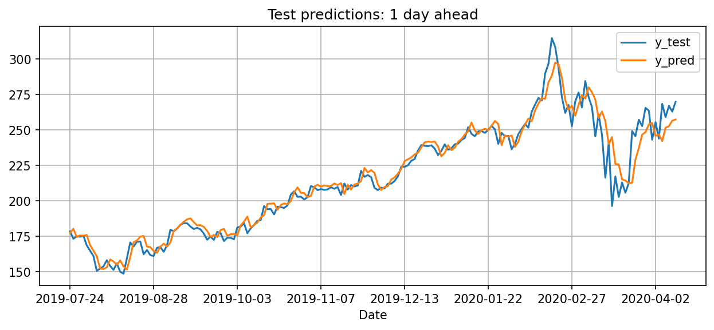
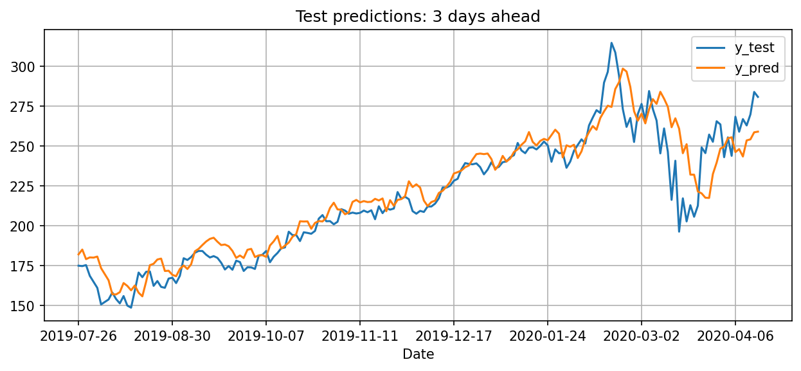

# stock_prediction_LSTM_technical_indicators
### Stock Price prediction using LSTM neural network and Technical Indicators.

In this project, the goal is to predict the Stock Price of M days into the future looking back at the past N days. With respect to other Stock prediction projects, in this one Technical Indicators are used as regressors, and they can potentially be many.
In this way, the use of some regressors combinations proved to be more robust in particular situations of the market (ex: high volatility, strong bullish/bearish trends, etc..) for stock prices predictions.

However, keep in mind that to obtain a very precise predicted value in a regression problem like this can be difficult, and in some cases the best approach is to see the output prices series of the model more like a "trend" instead of rely on it as an absolute price value prediction.

To start with your own predictions, just download a .csv file of the chosen company from one of your favorite sites (I've personally used Yahoo Finance) and import it in the notebook following the instructions in the code.
For better results I suggest to:

1. Do not use a too long temporal horizon for your prices dataset. This is particularly recommended for Company whose stock price changed a lot during the years.
2. Choose properly the hyperparameters of the network! As you will see, some layers (like dropout layers) are commented out in the code, but if the net is overfitting your data adjust its layout adding/removing layers and changing the number of neurons
3. Again, depending on the state of the market, you should properly choose also the number of past days to look at and how far in the future you want to predict. Common sense says that the further you want to predict, the worse the prediction will be and it is valid also in this case.

